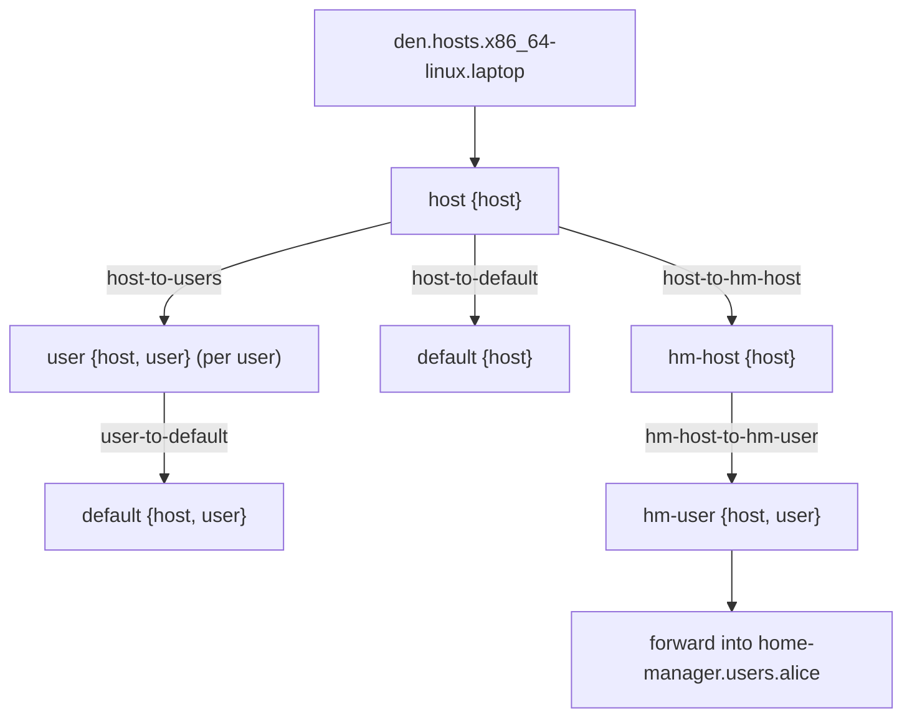

import { Steps, Aside } from '@astrojs/starlight/components';

<Aside title="Source" icon="github">
[`modules/policies/core.nix`](https://github.com/denful/den/blob/main/modules/policies/core.nix) --
[`modules/policies/flake.nix`](https://github.com/denful/den/blob/main/modules/policies/flake.nix) --
[`nix/lib/aspects/fx/pipeline.nix`](https://github.com/denful/den/blob/main/nix/lib/aspects/fx/pipeline.nix) --
[`nix/lib/aspects/fx/handlers/transition.nix`](https://github.com/denful/den/blob/main/nix/lib/aspects/fx/handlers/transition.nix)
</Aside>

## Pipeline overview

When Den evaluates a host, it runs a **resolution pipeline** driven by
[policies](/explanation/policies/) and [entities](/explanation/entities/).
Policies are directed edges that fan context out to downstream entity kinds;
each entity kind binds behavior for its resolved context.



<Steps>
1. **Host resolution**

   For each entry in `den.hosts.<system>.<name>`, the pipeline creates a
   `host` scope. The host's own aspect is resolved via `den.schema.host.includes`,
   binding owned configs for the host's class.

2. **Core policies fan out**

   Core policies ([`modules/policies/core.nix`](https://github.com/denful/den/blob/main/modules/policies/core.nix))
   define the fundamental traversal edges:

   | Policy | From | To | Resolve |
   |---|---|---|---|
   | `host-to-users` | `host` | `user` | One edge per `host.users` entry |
   | `host-to-default` | `host` | `default` | Identity (passes context through) |
   | `user-to-default` | `user` | `default` | Identity |

   Each policy's `resolve` function receives the current context and returns a
   list of downstream contexts. `host-to-users` fans out: one `{ host, user }`
   pair per user declared on the host.

3. **Battery policies create derived entity kinds**

   Batteries register additional policies that create derived entity kinds when
   their conditions are met. Each battery uses `makeHomeEnv` to produce policies
   for the new entity kinds:

   | Policy | Condition | Target entity kind |
   |---|---|---|
   | `host-to-hm-host` | HM enabled, host has `homeManager`-class users | `hm-host` |
   | `hm-host-to-hm-user` | Per `homeManager`-class user | `hm-user` |
   | `host-to-hjem-host` | hjem enabled, host has `hjem`-class users | `hjem-host` |
   | `hjem-host-to-hjem-user` | Per `hjem`-class user | `hjem-user` |
   | `host-to-maid-host` | nix-maid enabled, host has `maid`-class users | `maid-host` |
   | `maid-host-to-maid-user` | Per `maid`-class user | `maid-user` |
   | `host-to-wsl-host` | NixOS host with `wsl.enable` | `wsl-host` |

   The `-host` entity kind imports the battery's OS module (e.g., `home-manager.nixosModules.home-manager`).
   The `-user` entity kind forwards the resolved user aspect into the appropriate
   namespace (e.g., `home-manager.users.<name>`).

4. **Deduplication**

   The pipeline tracks a `seen` set keyed by context identity.
   When a scope is entered for the first time with a given context, the full
   aspect (owned configs + statics + parametric matches) is included.
   Subsequent visits with the same context key skip already-applied includes,
   preventing `den.default` configs from being applied twice when the same
   aspect appears at multiple entity kinds.

   Each policy transition creates an independent scope with its own dedup
   state, so entity kinds reached through different policies are isolated.

5. **Home configurations**

   Standalone `den.homes` entries follow a separate path with their own
   core policy:

   ```mermaid
   flowchart TD
     home["den.homes.x86_64-linux.alice"] --> homestage["home {home}"]
     homestage -->|"home-to-default"| hdef["default {home}"]
     homestage --> hmc["homeConfigurations.alice"]
   ```

   Home scopes have no `host` in context, so policies and provides requiring
   `{ host }` are not activated. The `home-to-default` policy still applies
   shared defaults.

6. **Output**

   Flake-level policies (`modules/policies/flake.nix`) drive the final
   assembly. `to-os-outputs` resolves all hosts for a system;
   `to-hm-outputs` resolves all homes. Each resolved entity
   is instantiated (`lib.nixosSystem`, `darwinSystem`, or
   `homeManagerConfiguration` depending on class) and placed into
   `flake.nixosConfigurations`, `flake.darwinConfigurations`, or
   `flake.homeConfigurations`.

</Steps>

## See also

- [Entities and Schema](/explanation/entities/) -- what entities are and how they feed the pipeline
- [Policies](/explanation/policies/) -- how entities relate
- [Quirks & Pipes](/explanation/quirks-and-pipes/) -- structured data flow between aspects
- [Fleets & Multi-Host](/explanation/fleet/) -- cross-host resolution and data flow
- [Aspects](/explanation/aspects/) -- how entities resolve
