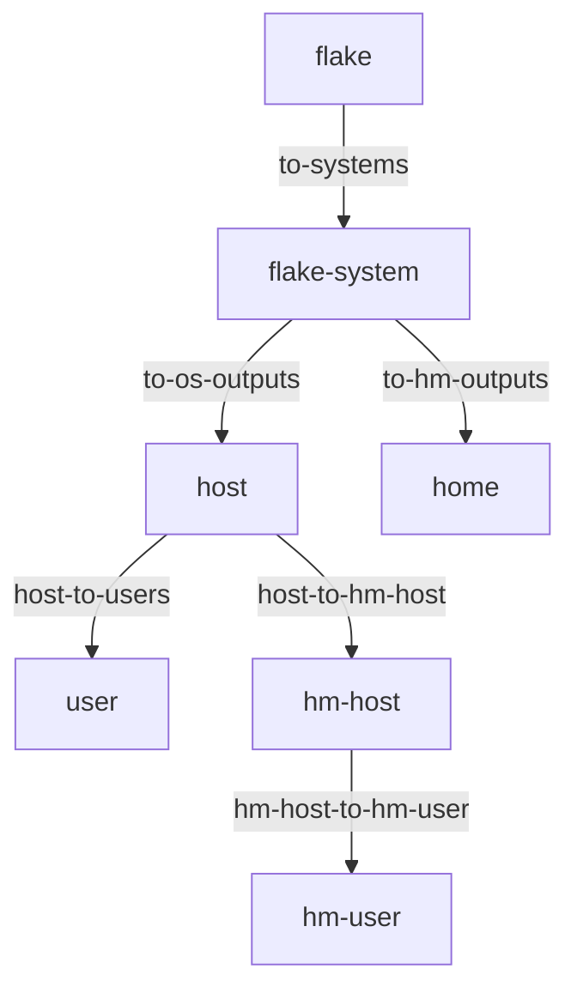

import { Aside } from '@astrojs/starlight/components';

<Aside title="Source" icon="github">
[`nix/lib/policy-effects.nix`](https://github.com/denful/den/blob/main/nix/lib/policy-effects.nix) --
[`modules/policies/core.nix`](https://github.com/denful/den/blob/main/modules/policies/core.nix) --
[`modules/policies/flake.nix`](https://github.com/denful/den/blob/main/modules/policies/flake.nix)
</Aside>

Policies are one of Den's core concerns.
Where [entities](/explanation/entities/) declare *what things are* and
[aspects](/explanation/aspects/) declare *what behavior applies*,
**policies** declare *how entities relate* — the directed edges
that connect entity kinds, enrich context, route content, and drive
structured data flow.

## What is a policy?

A policy is a function from context to a list of effects. The pipeline
calls it when all required context args are present:

```nix
den.policies.host-to-users = { host, ... }:
  map (user: policy.resolve.to "user" { inherit host user; })
    (lib.attrValues host.users);
```

Policies are **first-class values** — they live in `den.policies` as a
registry, and are **activated** by including them in `includes` lists.

## The policy graph



Each arrow is a policy. The pipeline walks this graph at evaluation time:
starting from the root, it fires every active policy whose required args
match the current context, dispatches the returned effects, and recurses
into resolved targets.

## Writing a policy

A policy is a bare function that destructures the current context and
returns a list of [policy effects](/reference/policies/):

```nix
den.policies.my-enrichment = { host, ... }:
  let inherit (den.lib.policy) resolve; in
  [ (resolve { myFlag = true; }) ];
```

Policy effect constructors live under `den.lib.policy` — use
`let inherit (den.lib.policy) resolve; in` or access them directly as
`den.lib.policy.resolve`, `den.lib.policy.include`, etc.

The `{ host, ... }:` pattern means this policy fires only when `host` is
in context. Den introspects the function args and checks satisfaction
automatically.

### Common effect types

| Effect | What it does |
|---|---|
| `policy.resolve bindings` | Enrich current scope or create a child entity (see below) |
| `policy.resolve.to kind bindings` | Create a child scope for a specific entity kind |
| `policy.include aspect` | Inject an aspect into current resolution (walks the tree) |
| `policy.exclude aspect` | Remove an aspect via constraint registry |
| `policy.route spec` | Route class content between scopes |
| `policy.provide spec` | Deliver a module directly to a class (bypasses tree walk) |
| `policy.instantiate entity` | Request post-pipeline instantiation |
| `pipe.from name stages` | Quirk data routing (see [Quirks](/explanation/quirks-and-pipes/)) |

### Enrichment vs entity resolution

`policy.resolve` behaves differently depending on what's in the bindings:

- **Entity keys** (keys matching `den.schema` kinds like `host`, `user`):
  creates a **child scope** and resolves a new entity. This is how
  `host-to-users` fans out — each user becomes a separate scope.
- **Non-entity keys**: **enriches** the current scope by merging new
  bindings into the context. No new scope is created. Deferred aspects
  that needed the new bindings are drained.

```nix
# Enrichment — adds myFlag to current context, no new scope
policy.resolve { myFlag = true; }

# Entity resolution — creates a child "user" scope
policy.resolve.to "user" { inherit host user; }
```

This distinction matters: enrichment widens what aspects can resolve
in the current scope, while entity resolution creates an isolated
child scope with its own emissions.

### `policy.include` vs `policy.provide`

Both inject configuration, but through different paths:

| | `policy.include` | `policy.provide` |
|---|---|---|
| **Path** | Walks through the aspect tree | Bypasses the tree entirely |
| **Dedup** | Subject to include dedup | Deduped by policy/class/path |
| **Use when** | Injecting aspects that should participate in the full resolution (constraints, nested includes, parametric dispatch) | Delivering raw modules directly to a class when you don't need tree processing |

```nix
# include: the aspect is resolved through the tree
policy.include den.aspects.monitoring

# provide: the module goes straight to the class
policy.provide { class = "nixos"; module = { services.foo.enable = true; }; }
```

## Activating policies

Declaring a policy in `den.policies` only **registers** it. To activate,
include it in an `includes` list:

```nix
# Activate for all hosts
den.schema.host.includes = [ den.policies.my-enrichment ];

# Activate for a specific aspect
den.aspects.igloo.includes = [ den.policies.my-enrichment ];

# Activate globally
den.default.includes = [ den.policies.my-enrichment ];
```

Policies and aspects mix freely in `includes` — the pipeline distinguishes
them by the `__isPolicy` tag.

<Aside>
Built-in core policies are always active — they're activated via
`den.schema.*.includes` in `modules/policies/core.nix` and
`modules/policies/flake.nix`.
</Aside>

## Deactivating policies

Use `excludes` on an aspect to prevent a policy from firing in its subtree:

```nix
den.aspects.igloo = {
  includes = [ den.policies.add-marker ];
  excludes = [ den.policies.add-marker ];
};
```

Excludes are **authoritative** — a parent scope's exclude cannot be
overridden by a child `includes`. This prevents downstream aspects from
re-enabling policies that a parent explicitly blocked.

## Conditional policies

### `policy.for entity policy`

Fire only when a specific entity is in context (matched by `id_hash`):

```nix
den.schema.host.includes = [
  (den.lib.policy.for den.hosts.x86_64-linux.igloo
    den.policies.igloo-specific)
];
```

### `policy.when predicate policy`

Fire only when a predicate over context returns true:

```nix
den.schema.host.includes = [
  (den.lib.policy.when ({ host, ... }: host.wsl.enable)
    den.policies.wsl-support)
];
```

Both wrappers preserve the inner policy's identity — `excludes`
still works against the wrapped policy.

Both accept a single policy or a list of policies.

## Relation to other concerns

1. **Data** ([Entities](/explanation/entities/)) defines what an entity *is*.
2. **Policies** (this page) define how entities *relate*, enrich context, and route data.
3. **Behavior** ([Aspects](/explanation/aspects/)) defines *how* entities resolve into configuration.

For the full API reference, see [den.policies reference](/reference/policies/).
For the complete activation/deactivation model, see [Policy Activation Deep Dive](/explanation/policy-activation/).
